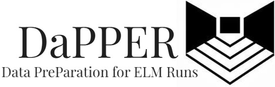

  

## About
The E3SM Land Model (ELM) has become useful for a wide range of investigations
across a broad array of scales--from single-site to global. Each ELM run
requires a hefty set of data formatted in a particular way. Two of the required
"types" of data are meteorological data (time series of "met forcings") and
parameter files (customizable "surface file"). As ELM capability grows, the
complexity of, for example, the surface files grows to accomodate new options
and parameters. Additionally, met data is usually sampled at high temporal
frequency (daily/subdaily). These data requirements place a large startup burden
on (particularly new) users of ELM. 

DaPPER provides tools to alleviate these burdens to some degree. DaPPER relies
on Google Earth Engine and other APIs to make sampling met data and surface file
data fast, scalable to very large domains, and flexible to different "types" of
grid cells (e.g. arbitrary polygons like watersheds instead of rectangular
grids). DaPPER is being developed with the goals of NGEE-Arctic Crosscut 3 in
mind, which focuses on scaling and resolution experiments. However, the broader
vision is to develop a toolkit that is useful across the E3SM project, not just
NGEE. We also hope that DaPPER can provide some documentation and clarity
regarding the creation and use of these input data, which to-date seems to be
lacking.

DaPPER is under development, which means that you should consider everything
*beta* and subject to change daily. We try to alleviate this instability by
maintaining a `dev` branch of the repo that can be very dynamic. The `main`
branch is intended to be more stable. If you're not sure, just stick to the
`main` repo.

DaPPER's "lead developer" is Jon Schwenk at LANL, but many contribute code,
ideas, and review (see Contributors below).

## Getting started
Refer to the documentation [here](https://ngee-arctic.github.io/dapper/getting-started.html).

## Usage
We have created some [jupyter notebooks](https://github.com/NGEE-Arctic/dapper/tree/main/docs/notebooks) to demonstrate ways to use `dapper` tools.

## Workspace directory
The `workspace/` directory is a holding area for specialized or in-progress tools outside of the core functionality of the `dapper` python package. Some of these tools may eventually be implemented within dapper formally, but this provides a space for exploratory tools without the burden of full dapper integration.  See README.md in `workspace/` for guidance on how to add new tools.

The workspace is **outside the core Python package** and not part of the installed distribution. Files here are local to the repository and should not import from or depend on being imported by the main `dapper` package structure. **The workspace folder must never be bundled in Python package releases.**

## Contributing & Contact
Feel free to fork or branch the repo and make improvements. Open a pull request
and we'll check it out. For suggestions and other general queations regarding
`dapper`, email **dapper@lanl.gov**.

### Contributors

- [Jon Schwenk](https://github.com/jonschwenk)
- [Ryan Crumley](https://github.com/ryanlcrumley)
- [Rich Fiorella](https://github.com/rfiorella)
- [Cade Trotter](https://github.com/ctrotterlanl)
- [Jemma Stachelek](https://github.com/jsta)
- [Ross Spicer](https://github.com/rwspicer)
- [Maggie Farley](https://github.com/maggiefarley)
- [Claire Bachand](https://github.com/cbachand)

## Copyright/License
O4898 (for copyright verification); see the [License](https://github.com/NGEE-Arctic/dapper/tree/main/license.md) file.
